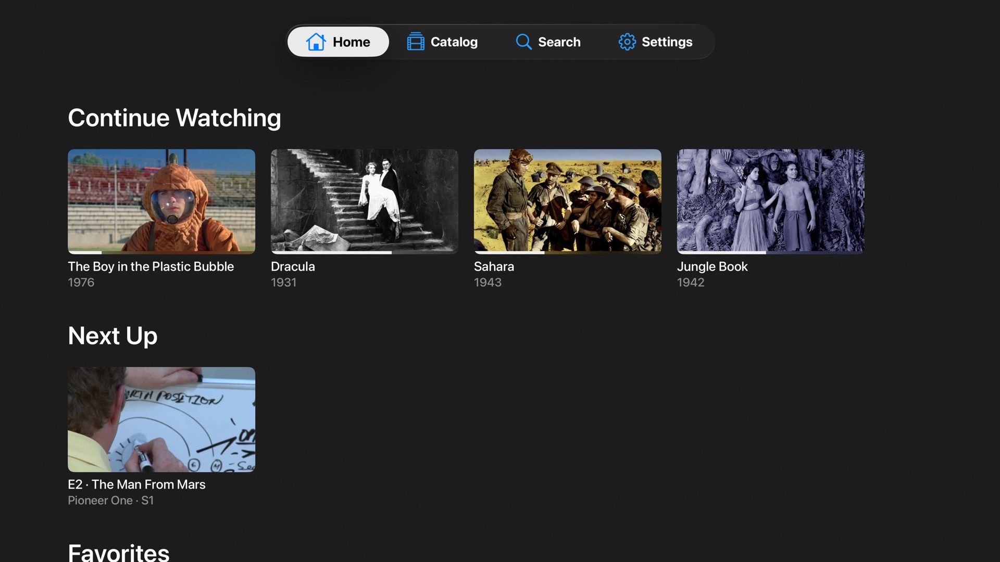
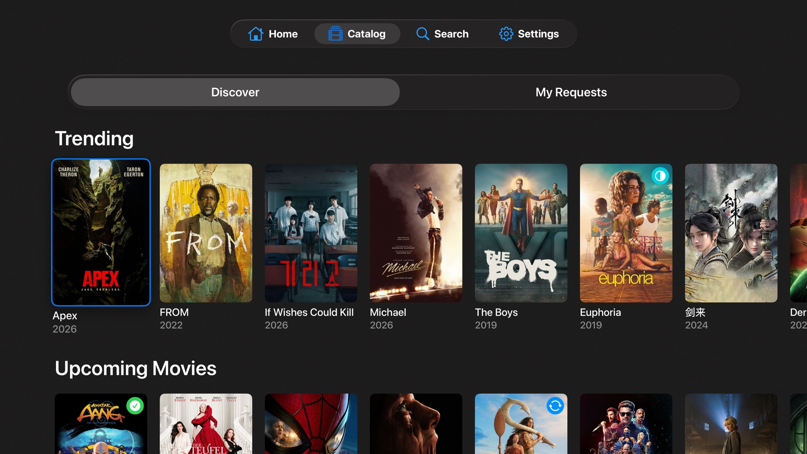
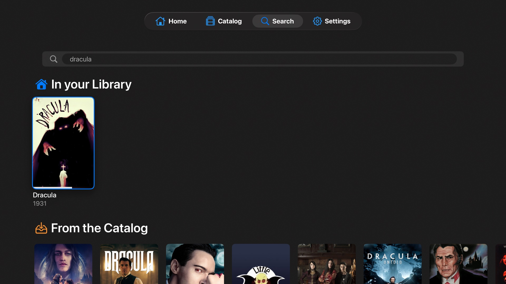
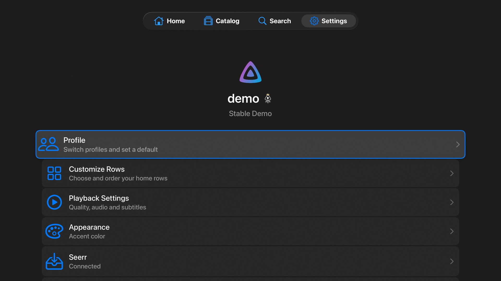

<h1 align="center">JellySeeTV</h1>

<p align="center">
  <b>Your Jellyfin library <i>and</i> Seerr — together on Apple TV.</b><br>
  Native tvOS, instant playback, real HDR, real Dolby Atmos.<br>
  Browse what you own. Request what's missing. Without ever leaving the couch.
</p>

<p align="center">
  
  
  
  
  
</p>

> 🧪 **Public Beta is open.** Install via TestFlight: **https://testflight.apple.com/join/eFKDaaXr**
> See [BETA.md](BETA.md) for what to focus on and how to report bugs.

---

## Two services, one remote

JellySeeTV is the only **open-source** Apple TV client that brings **Jellyfin and Seerr together in the same UI**. Watch what's already on your server. Spot something on a trending row that isn't there yet? Request it from inside the app — Seerr handles the rest.

No more switching to a phone, opening a web UI, or pinging your homelab admin. Single sign-on, one focus-driven interface, the full library + request loop on the TV where you actually watch.

## Open source, end to end

Most Apple TV media players are closed-source binaries you have to trust. JellySeeTV isn't. Every byte that touches your server is in this repo, your auth tokens stay in your Keychain, and there's no telemetry, no analytics, no third-party SDK phoning home.

JellySeeTV is licensed under **GPL-3.0 with an Apple Store / DRM Exception** — fork it, study it, build your own version, but no one can take it private. Modifications must stay open. The exception clause in the LICENSE keeps the App Store and TestFlight distribution paths legally clean. The video stack underneath ([AetherEngine](https://github.com/superuser404notfound/AetherEngine)) is **LGPL-3.0** with the same Apple Store exception, so the engine can be reused in other apps while engine-level improvements flow back to the community. Both are auditable, buildable from source, and free of any vendor lock-in. Self-host the server, self-build the client — the whole loop is yours.

## Why JellySeeTV

Jellyfin is great. The existing Apple TV clients are either web wrappers or built around third-party players that fight tvOS instead of using it. JellySeeTV is built natively from the ground up: SwiftUI on top, a custom video engine underneath, and the same HIG patterns Apple uses for TV+ — focus engine, Siri Remote gestures, transport bar, info panel. Plays the file directly from your server in almost every case, no transcoding required.

And the Seerr integration isn't a tacked-on link to a web view — it's a first-class part of the app, with its own browse rows, request flow, and status tracking right next to your library.

## Screenshots

<table>
  <tr>
    <td width="50%"></td>
    <td width="50%"></td>
  </tr>
  <tr>
    <td align="center"><sub>Home</sub></td>
    <td align="center"><sub>Catalog</sub></td>
  </tr>
  <tr>
    <td></td>
    <td></td>
  </tr>
  <tr>
    <td align="center"><sub>Search</sub></td>
    <td align="center"><sub>Settings</sub></td>
  </tr>
</table>

## Features

### 📚 Browse & discover
- **Server discovery** — finds Jellyfin on your network automatically, or add manually
- **Home** — Continue Watching, Next Up, Latest by library, fully customizable
- **Library** — Movies, Series, Collections with poster grids and instant filtering
- **Series view** — season picker, episode list, "Up Next" highlighting
- **Search** — across your whole server, results as you type
- **Image caching & prefetching** — posters and backdrops load before you focus them

### 🎬 Watch
- **Direct Play** for almost every codec your Apple TV understands: H.264, HEVC, HEVC Main10, AV1
- **HDR10, Dolby Vision, HLG** — auto-detected, sent through with full color metadata, display switches to HDR mode automatically (Match Content)
- **Dolby Atmos** via EAC3+JOC, wrapped as Dolby MAT 2.0 — your AVR's Atmos light actually comes on
- **Multichannel surround** — 5.1, 7.1 with correct channel layout
- **Resume** from where you left off, on any device
- **Intro skip** — auto-detected from your Jellyfin server, optional one-tap skip
- **Next episode** — auto-play with countdown, or just an overlay; configurable
- **Subtitle support** — SRT, with track selection during playback
- **Audio track switcher** — pick the language or surround mix you want, mid-playback
- **Native player UI** — same transport bar, scrub preview and info panel as Apple TV+

### 📨 Request what's missing
- **Seerr integration** — browse trending and popular media right inside the app
- **One-tap requests** — for movies and full series
- **Track status** — see what's been approved, declined, or is already downloading
- **Single sign-on** — log in once, JellySeeTV handles your Seerr session

### 🌍 Personal
- **26 languages** — German, English, Spanish, French, Italian, Japanese, Korean, Norwegian, Dutch, Polish, Portuguese (BR + PT), Russian, Swedish, Simplified + Traditional Chinese, Turkish, Ukrainian, Czech, Slovak, Croatian, Finnish, Greek, Hungarian, Romanian, Danish
- **Dark, minimal design** — built for living rooms, not for desks
- **Liquid Glass** UI accents on tvOS 26+
- **Siri Remote optimized** — touch surface scrubbing, click for play/pause, swipe gestures throughout

## Built on

JellySeeTV is a thin native shell over a custom video stack. The interesting part is what *isn't* there: no VLCKit, no third-party players, no web views. Just Apple's frameworks plus a Swift package that handles the formats Apple's own player can't.

| Component | Technology |
|---|---|
| UI | SwiftUI + UIKit interop where needed |
| Video engine | [AetherEngine](https://github.com/superuser404notfound/AetherEngine) — FFmpeg demux, VideoToolbox decode, AVPlayer for Atmos passthrough |
| Display | `AVSampleBufferDisplayLayer` driven by a `CMTimebase` synced to the audio clock |
| Audio | `AVSampleBufferAudioRenderer` for PCM, `AVPlayer` over local HLS for Dolby MAT 2.0 (Atmos) |
| Networking | `URLSession` against the Jellyfin REST API |
| Persistence | Keychain for credentials, no telemetry storage |
| Media server | [Jellyfin](https://jellyfin.org) |

If you want the full pipeline detail — HDR routing, Atmos passthrough, A/V sync, channel-layout tagging — see the [AetherEngine README](https://github.com/superuser404notfound/AetherEngine#readme).

## Requirements

| | Min |
| --- | --- |
| Apple TV | 4K (any generation) |
| tvOS | 26.0 |
| Jellyfin server | 10.9+ recommended |
| Seerr (optional) | 2.0+ |

A 1080p Apple TV HD will technically run the app, but Direct Play of 4K HDR content needs the 4K hardware.

## Building from source

```bash
git clone https://github.com/superuser404notfound/JellySeeTV.git
cd JellySeeTV
open JellySeeTV.xcodeproj
```

Pick the `JellySeeTV` scheme, an Apple TV destination, and run. AetherEngine is wired in as a local Swift Package — you'll need it cloned next to this repo (or adjust the path in Package dependencies).

```
~/Dev/
├── JellySeeTV/
└── AetherEngine/
```

Xcode 26+ and Swift 6.0+ are required.

## Roadmap

- [x] Public TestFlight beta
- [ ] App Store release
- [ ] iOS / iPadOS companion app
- [ ] Live TV + DVR support
- [ ] Music library support

## Related

- [AetherEngine](https://github.com/superuser404notfound/AetherEngine) — the video engine powering JellySeeTV
- [Jellyfin](https://github.com/jellyfin/jellyfin) — the free software media system
- [Seerr](https://github.com/Fallenbagel/jellyseerr) — request management for Jellyfin
- [Swiftfin](https://github.com/jellyfin/Swiftfin) — official Jellyfin client for iOS / tvOS (VLCKit-based)

## Built with

JellySeeTV is vibe-coded — designed and shipped by [Vincent Herbst](https://github.com/superuser404notfound) in close pair-programming with **Claude** (Anthropic). The commit log is the receipt: nearly every commit carries a `Co-Authored-By: Claude` trailer.

## License

[GPL-3.0 with Apple Store / DRM Exception](LICENSE). The exception clause keeps App Store and TestFlight distribution legally clean while the GPL keeps the source open and forks copyleft.
